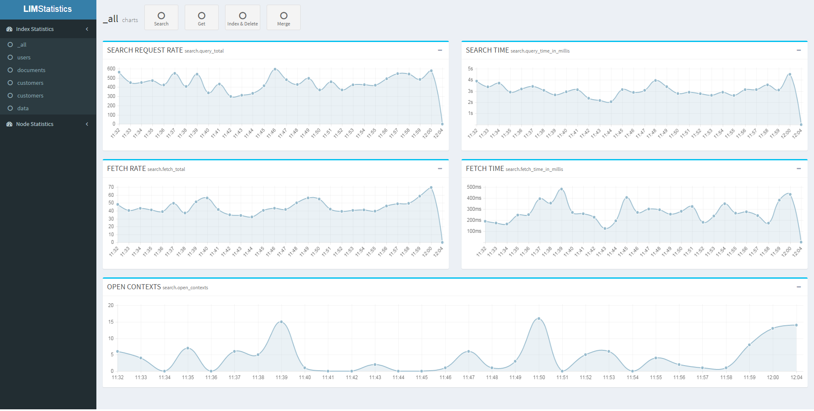
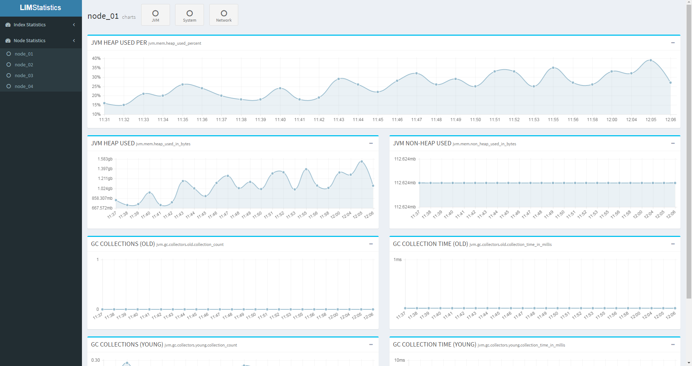

# lim as an alternative for monitoring elasticsearch

lim logs node stats and index stats separately. You can see your index stats(search, log, fetch, etc.) within all nodes and keeps calculated datas.

## Index Statistics

## Node Statistics
